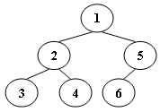

# 03-树3 Tree Traversals Again （25 分）

时间限制: 400 ms

内存限制: 64 MB

代码长度限制: 16 KB

An inorder binary tree traversal can be implemented in a non-recursive way with a stack. For example, suppose that when a 6-node binary tree (with the keys numbered from 1 to 6) is traversed, the stack operations are: `push(1); push(2); push(3); pop(); pop(); push(4); pop(); pop(); push(5); push(6); pop(); pop();`. Then a unique binary tree (shown in Figure 1) can be generated from this sequence of operations. Your task is to give the postorder traversal sequence of this tree.



## Input Specification

Each input file contains one test case. For each case, the first line contains a positive integer N (≤30) which is the total number of nodes in a tree (and hence the nodes are numbered from 1 to N). Then 2N lines follow, each describes a stack operation in the format: "Push X" where X is the index of the node being pushed onto the stack; or "Pop" meaning to pop one node from the stack.

## Output Specification

For each test case, print the postorder traversal sequence of the corresponding tree in one line. A solution is guaranteed to exist. All the numbers must be separated by exactly one space, and there must be no extra space at the end of the line.

## Sample Input

```bash
6
Push 1
Push 2
Push 3
Pop
Pop
Push 4
Pop
Pop
Push 5
Push 6
Pop
Pop
```

## Sample Output

```bash
3 4 2 6 5 1
```

## 提交结果

|测试点|提示|结果|耗时|内存|
|:---|:---|:---|:---|:---|
|0|sample 有单边有双边结点|答案正确|2 ms|376KB|
|1|单边喇叭张开形|答案正确|3 ms|376KB|
|2|交错|答案正确|2 ms|384KB|
|3|N=1|答案正确|2 ms|376KB|
|4|N=30，复杂组合|答案正确|2 ms|384KB|
