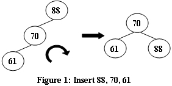
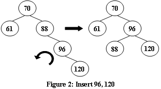

04-树5 Root of AVL Tree （25 分）
===

>作者: 陈越</br>
单位: 浙江大学</br>
时间限制: 400 ms</br>
内存限制: 64 MB</br>
代码长度限制: 16 KB</br>

An AVL tree is a self-balancing binary search tree. In an AVL tree, the heights of the two child subtrees of any node differ by at most one; if at any time they differ by more than one, rebalancing is done to restore this property. Figures 1-4 illustrate the rotation rules.





Now given a sequence of insertions, you are supposed to tell the root of the resulting AVL tree.

Input Specification
---

Each input file contains one test case. For each case, the first line contains a positive integer N (≤20) which is the total number of keys to be inserted. Then N distinct integer keys are given in the next line. All the numbers in a line are separated by a space.

Output Specification
---

For each test case, print the root of the resulting AVL tree in one line.

Sample Input 1
---

```bash
5
88 70 61 96 120
```

Sample Output 1
--

```bash
70
```

Sample Input 2
---

```bash
7
88 70 61 96 120 90 65
```

Sample Output 2
---

```bash
88
```

提交结果
---

|测试点|提示|结果|耗时|内存|
|:---|:---|:---|:---|:---|
0|fig 1 - LL|答案正确|3 ms|372KB
1|fig 2 - RR|答案正确|2 ms|512KB
2|fig 3 - RL|答案正确|2 ms|384KB
3|fig 4 - LR|答案正确|2 ms|512KB
4|深度LL旋转|答案正确|2 ms|384KB
5|最大N，深度RL旋转|答案正确|3 ms|384KB
6|最小N|答案正确|2 ms|384KB